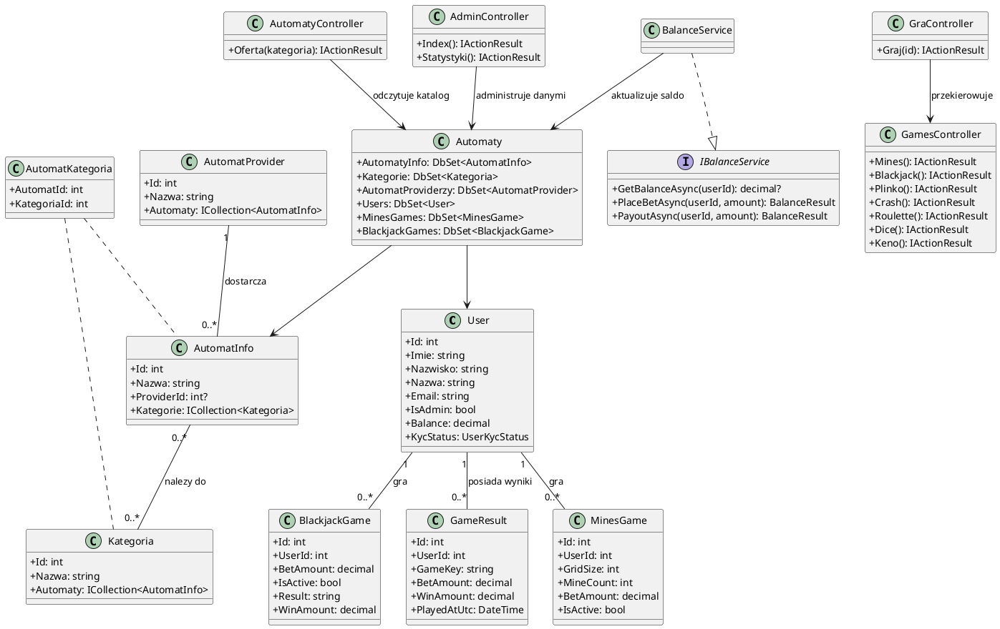
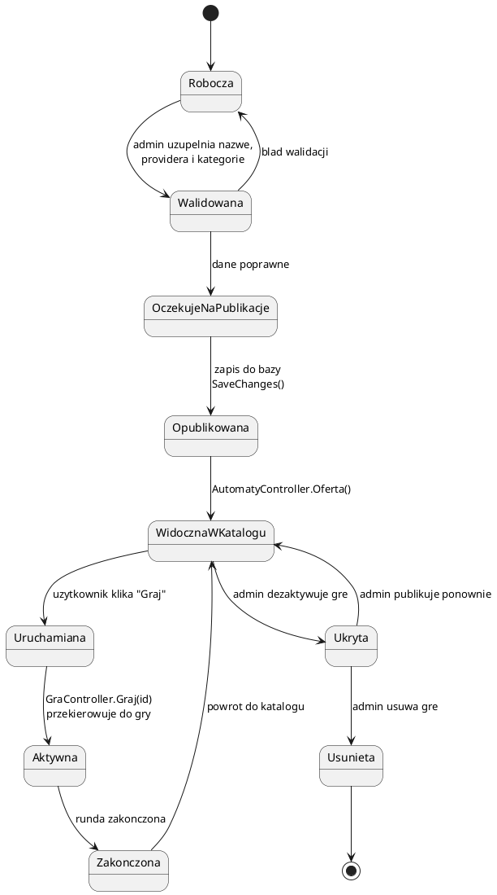
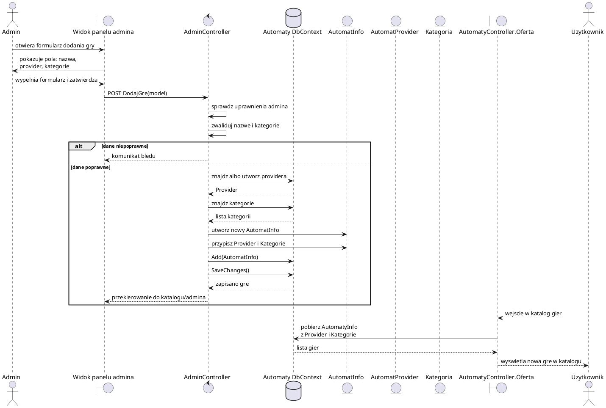

# Diagramy UML - Casino Royale

Ponizsze diagramy sa uproszczona wersja modelu aplikacji. Bazuja na strukturze projektu ASP.NET MVC: encjach katalogu gier (`AutomatInfo`, `Kategoria`, `AutomatProvider`), kontekscie bazy danych (`Automaty`), kontrolerach oraz serwisach obslugujacych gry i saldo.

## 1. Diagram klas

## 2. Diagram stanow - gra w katalogu

Ten diagram opisuje uproszczony cykl zycia gry widocznej w katalogu. W projekcie czesc gier jest dopisywana recznie jako `Originals`, a czesc pochodzi z bazy danych, wiec stan `Robocza` i `OczekujeNaPublikacje` mozna traktowac jako rozsadne rozszerzenie administracyjne.

## 3. Diagram przebiegu - dodanie gry do katalogu

